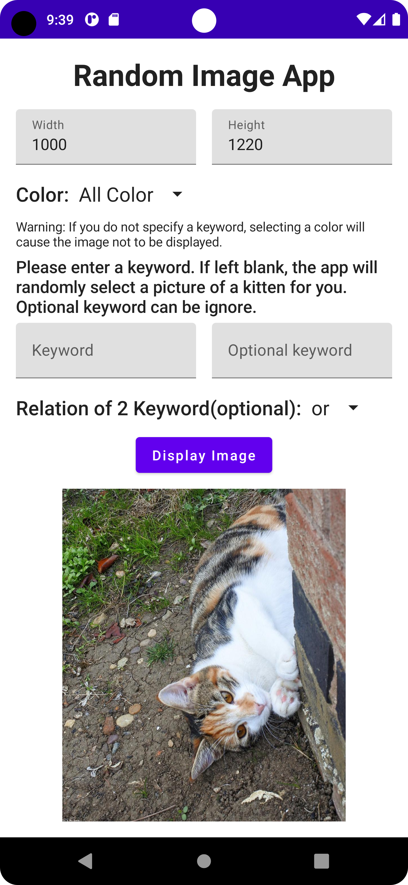
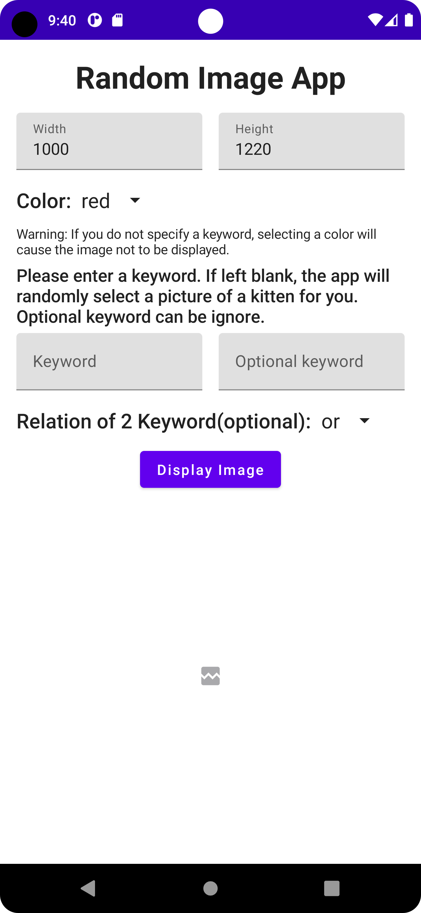
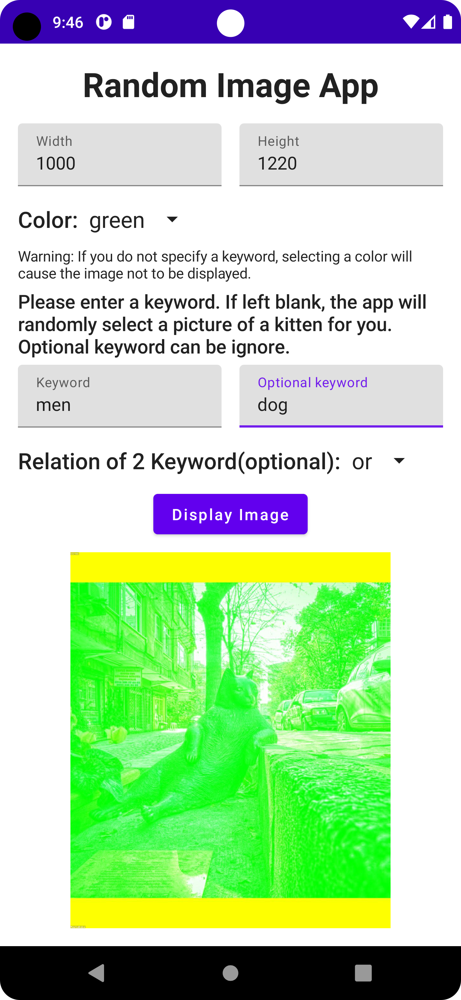
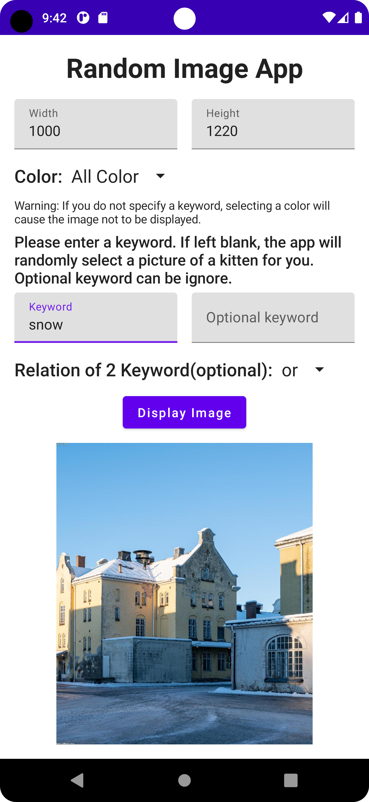

# Assignment 4 CN333

## List of contributors
#### Kantapon Makwong 6310520066
#### Sabina Llewellyn 6310610982
#### Pavisa Sirirojvorakul 6310620064

## Mobile Application function
In this Android application, users will be able to generate a picture by inputting information into the application. 
These are the functions of the application.

Application random image from [**LoremFlickr**](https://loremflickr.com)

1. Users can choose the size of the image, and if the user enters an incorrect size, the program will display a warning message and prompt for a new value.
1. Users can select the type of image from the options.
1. Once the user inputs and selects complete and correct data, they can press the display image button.
1. When the display image button is pressed, the program will display the image according to the values specified by the user in the above steps.


## Link to the video demonstration 
LinkVideo as below

[](https://youtu.be/Ov8B12nG7io)

## How to run this application
1. Clone this project to your android studio
  ```
  git clone https://github.com/6310520066/cn333as4.git
  ```

2. Make sure you are in master branch
  ```
  git checkout master
  ```

3. Build this project
  ```
  ⌘ + fn + F9 (Mac) OR Shift + F9 (Windows)
  ```

4. Run application
  ```
  ⌘ + fn + F10 (Mac) OR Shift + F10 (Windows)
  ```
  
OR
 
Import project from version control select GIT and link of repository as follow
```
https://github.com/6310520066/cn333as4.git
```


## Example Display Random Image App

#### Main Screen of the Application


#### Error Screen


#### Random Image with 2 keyword and select color


#### Random Image with 1 keyword

