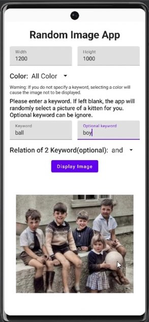

# Assignment 4 CN333

# List of contributors
#### Kantapon Makwong 6310520066
#### Sabina Llewellyn 6310610982
#### Pavisa Sirirojvorakul 6310620064

# Mobile Application function
This andriod application users will be able to generate a picture by inputing information to the application.
These are the functions of the application.

1.Users can choose the size of the image, and if the user enters an incorrect size, the program will display a warning message and prompt for a new value.
2.Users can select the type of image from the options.
3.Once the user inputs and selects complete and correct data, they can press the display image button.
4.When the display image button is pressed, the program will display the image according to the values specified by the user in the above steps.

LinkVideo = > [Click Here.](https://youtu.be/Ov8B12nG7io)

## Example Display QuizGame

### Main Screen of the Application

### Generated Picture from the Application

